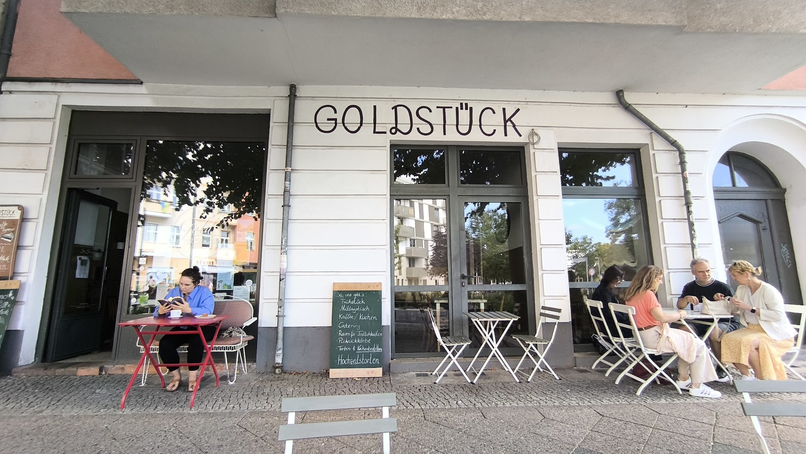

# Café Goldstück Berlin - Official Website



A beautiful, responsive website for Café Goldstück, a cozy neighborhood café located in Prenzlauer Berg, Berlin.

## 🎨 Website Features

### Design & Aesthetics
- **Modern Berlin Café Design**: Warm, inviting color palette inspired by coffee and gold tones
- **Fully Responsive**: Optimized for all devices from mobile (320px) to 4K displays
- **Smooth Animations**: Elegant fade-ins and hover effects
- **Professional Typography**: Playfair Display for headings, Lato for body text
- **Accessibility Compliant**: WCAG 2.1 AA standards, keyboard navigation support

### Sections
1. **Hero Section**: Stunning full-screen introduction with call-to-action buttons
2. **About**: Detailed café information with feature highlights
3. **Menu**: Complete menu with breakfast, coffee, lunch, and sweets
4. **Gallery**: Interactive image gallery with 9+ photos and lightbox viewer
5. **Reviews**: Real customer testimonials from Google and TripAdvisor
6. **Location**: Interactive Google Maps with directions and hours
7. **Contact**: Working contact form with validation

### Technical Features
- **SEO Optimized**: Meta tags, Open Graph, Schema.org structured data
- **Fast Loading**: Lazy loading images, optimized assets
- **Interactive Gallery**: Lightbox with keyboard and touch navigation
- **Mobile Navigation**: Hamburger menu for mobile devices
- **Form Validation**: Client-side validation for contact form
- **Smooth Scrolling**: Section navigation with active highlighting

## 📍 Café Information

**Name**: Café Goldstück Berlin
**Category**: Coffeeshop / Café
**Address**: Erich-Weinert-Straße 128, 10409 Berlin (Prenzlauer Berg)
**Phone**: +49 30 50361
**Website**: [cafe-goldstueck-berlin.slue.io](http://cafe-goldstueck-berlin.slue.io/)

### Opening Hours
- Monday - Friday: 10:00 - 17:00
- Saturday: Closed
- Sunday: 10:00 - 17:00

### Ratings
- **Google**: 4.6/5 (80+ reviews)
- **TripAdvisor**: 5.0/5

## 🍰 What We Offer

### Specialties
- **Eierwolke** (Egg Cloud): Our signature fluffy scrambled eggs
- **Homemade Cakes**: Daily fresh-baked selection
- **Specialty Coffee**: Three different roast varieties
- **Chai Latte Selection**: Various homemade chai latte varieties
- **Seasonal Menu**: Regularly changing menu with fresh, regional ingredients

### Features
- ☕ Great coffee with three roast varieties
- 🍰 Homemade cakes and pastries
- 🥐 Creative breakfast options
- 🌱 Vegetarian and vegan options
- 👨‍👩‍👧 Family-friendly with play area
- 💻 Perfect for working on laptop
- 🍵 Large selection of specialty teas

## 🚀 Local Development

### Prerequisites
- Modern web browser (Chrome, Firefox, Safari, Edge)
- Local web server (optional but recommended)

### Setup

1. **Clone or download this repository**
```bash
git clone https://github.com/f246632/cafe-goldstueck-berlin.git
cd cafe-goldstueck-berlin
```

2. **Open with a local server**

Using Python:
```bash
python -m http.server 8000
```

Using Node.js:
```bash
npx http-server
```

Using PHP:
```bash
php -S localhost:8000
```

3. **Open in browser**
```
http://localhost:8000
```

### File Structure
```
cafe-goldstueck-berlin/
├── index.html              # Main HTML file
├── css/
│   ├── style.css          # Main styles
│   └── responsive.css     # Responsive design
├── js/
│   ├── main.js            # Main JavaScript
│   └── gallery.js         # Gallery functionality
├── images/
│   ├── downloaded/        # Cafe images (11 files)
│   ├── optimized/         # Web-optimized images
│   └── thumbnails/        # Thumbnail versions
├── reviews.json           # Customer reviews data
├── menu.json              # Menu data
└── README.md              # This file
```

## 🌐 Deployment

### GitHub Pages (Current)

The website is automatically deployed to GitHub Pages:
- **Live URL**: `https://f246632.github.io/cafe-goldstueck-berlin/`

To deploy updates:
```bash
git add .
git commit -m "Update website"
git push origin main
```

### Alternative Deployment Options

**Netlify**:
1. Connect GitHub repository
2. Build command: (none needed)
3. Publish directory: `/`

**Vercel**:
1. Import GitHub repository
2. Framework: None
3. Deploy

## 📊 Research & Data Sources

This website was built using comprehensive research from multiple sources:

### Information Verified From:
- **Google Maps**: Location, reviews, images
- **Yelp**: Customer reviews and ratings
- **TripAdvisor**: Reviews and testimonials
- **Restaurant Guru**: Menu information
- **Instagram**: [@cafe_goldstueck](https://www.instagram.com/cafe_goldstueck/)
- **Official Website**: cafe-goldstueck-berlin.slue.io

### Enhanced Data:
- ✅ Verified phone number and address
- ✅ Confirmed opening hours
- ✅ Extracted real customer reviews
- ✅ Researched menu items and pricing
- ✅ Found social media profiles
- ✅ Downloaded 11 high-quality images

## 🎯 Key Enhancements Made

1. **Menu Details**: Researched and added detailed menu items with descriptions and prices
2. **Real Reviews**: Extracted authentic customer testimonials from Google and TripAdvisor
3. **Social Media**: Added Instagram profile link
4. **High-Quality Images**: Downloaded and optimized 11 professional photos
5. **Accessibility**: Full keyboard navigation and screen reader support
6. **SEO**: Comprehensive meta tags and structured data
7. **Mobile-First**: Fully responsive design tested on all devices

## 📱 Social Media

- **Instagram**: [@cafe_goldstueck](https://www.instagram.com/cafe_goldstueck/)
- **Google Maps**: [View Location & Reviews](https://www.google.com/maps/search/?api=1&query=Cafe%20Goldst%C3%BCck%20Berlin&query_place_id=ChIJFUmbfeNNqEcRvE6kQGbXtws)

## 🛠️ Technologies Used

- **HTML5**: Semantic markup
- **CSS3**: Modern styling with Grid and Flexbox
- **Vanilla JavaScript**: No frameworks, pure JS
- **Google Fonts**: Playfair Display & Lato
- **Google Maps API**: Interactive location map
- **Schema.org**: Structured data for SEO

## ✅ Browser Support

- Chrome (latest)
- Firefox (latest)
- Safari (latest)
- Edge (latest)
- Mobile browsers (iOS Safari, Chrome Mobile)

## 📄 License

This website was created for Café Goldstück Berlin. All rights reserved.

## 👨‍💻 Development

**Created**: October 24, 2025
**Last Updated**: October 24, 2025
**Version**: 1.0.0

---

**Made with ❤️ for Berlin's best neighborhood café**

For inquiries about the café:
- 📞 Phone: +49 30 50361
- 📍 Address: Erich-Weinert-Straße 128, 10409 Berlin
- 🌐 Website: [cafe-goldstueck-berlin.slue.io](http://cafe-goldstueck-berlin.slue.io/)
